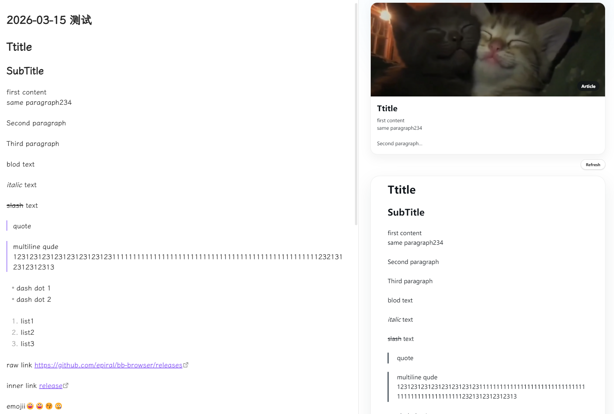
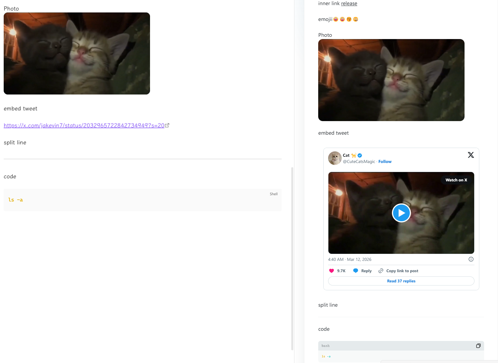

# 📰 X Article in Obsidian

[](#) [](#) [](#) [](#)

把当前 Markdown 笔记实时渲染成接近 X Article 的阅读侧栏，让你一边写，一边看最终阅读效果。

<p>
  <a href="./README_EN.md">English</a>
</p>

## 为什么用它

- ✨ 更像成稿，而不是普通编辑器预览
- 📝 自动跟随当前正在编辑或查看的笔记
- 🔄 切换文件和修改内容时可持续刷新
- 🧷 独立的 X / Twitter 链接支持富预览
- 📚 支持隐藏 frontmatter、标题兜底和草稿提示
- 🌐 支持中英文界面切换
- 🚀 支持复制发布脚本，或通过 Playwright MCP 直接发布

## 适合场景

- 写 X 长文
- 在 Obsidian 里完成写作和排版预览
- 边改边看文章封面、标题、摘要和正文节奏

## 安装

### 方式一：从 Release 安装

1. 打开 [GitHub Releases 页面](https://github.com/Icy-Cat/x-article-in-obsidian/releases/latest)
2. 下载最新发布版本中的压缩包并解压，解压后的文件夹中会有 `main.js`、`manifest.json`、`styles.css` 三个文件。
3. 打开 Obsidian 设置 → 第三方插件 → 已安装插件右侧的打开插件文件夹按钮，在打开的文件夹中新建文件夹，命名为 `x-article-in-obsidian`
4. 把文件复制新建的文件夹中

5. 回到 Obsidian，在已安装插件列表右侧点击刷新，找到 `X Article in Obsidian` 并启用插件


### 方式二：从源码构建

```bash
npm install
npm run build
```

将以下文件放到：

```text
<Vault>/.obsidian/plugins/x-article-in-obsidian/
├── main.js
├── manifest.json
└── styles.css
```

然后重载 Obsidian，并在 **设置 → 第三方插件** 中启用。

## 如何使用

### 预览文章

启用插件后，可以通过下面任一方式打开预览：

- 左侧功能区的报纸图标
- 命令面板中的 **打开预览**

预览面板会跟随当前 Markdown 笔记，并支持：

- 自动刷新
- 滚动同步
- 独立 X 链接富预览
- 代码块样式和复制按钮

### 配置项

在 **设置 → X Article in Obsidian** 中，当前可配置：

#### 通用

- `语言`：可选择跟随系统、English 或简体中文

#### 发布

- `Playwright Token`：手动填写 `PLAYWRIGHT_MCP_EXTENSION_TOKEN`
- `自动检测`：扫描本机可用 token 并写入插件设置，避免重复扫描
- `安装扩展`：打开 Playwright MCP Bridge 的 Chrome Web Store 安装页

#### 预览

- `自动刷新`：切换笔记或编辑当前笔记时，自动刷新右侧预览
- `隐藏 Frontmatter`：在预览中隐藏 YAML Frontmatter
- `文件名补标题`：当笔记开头没有一级标题时，自动用文件名补一个标题
- `显示草稿提示`：在正文上方显示一条仅本地可见的草稿提示

### 发布到 X

插件当前支持两种发布方式。

#### 方式一：复制发布脚本

1. 打开一篇 Markdown 笔记
2. 运行命令面板中的 **复制 X 发布脚本**
3. 在浏览器中打开 X Article 编辑器
4. 将脚本粘贴到控制台执行

#### 方式二：通过浏览器直接发布

1. 先安装 Playwright MCP Bridge 扩展
2. 本机安装 Node.js，并确保 `node`、`npm`、`npx` 在命令行中可用
3. 在设置中点击 **安装扩展** 跳转安装页面
4. 如有需要，在设置中填写或自动检测 `Playwright token`
5. 确保本机已经可用 Playwright MCP
6. 运行命令面板中的 **通过浏览器发布文章**

如果本地已保存 token，插件会优先使用，避免每次重新扫描浏览器配置。

如果出现 `spawn npx ENOENT`、`MCP process closed` 或类似启动失败提示，通常表示本机没有可用的 Node.js 环境，或者 `npx` 不在 PATH 中。先安装 Node.js，再重新打开 Obsidian。

## 发布开发

这个仓库已经配置了 GitHub Actions 自动构建和发布。

最新发布版本：<https://github.com/Icy-Cat/x-article-in-obsidian/releases/latest>

发布一个新版本时：

```bash
npm version patch
git push
git push --tags
```

发布流程会自动：

- 校验 `manifest.json` 中的版本号
- 构建 `main.js`
- 打包可分发 zip
- 上传 `main.js`、`manifest.json`、`styles.css` 和 zip 到 GitHub Release

`versions.json` 会在执行 `npm version` 时自动同步更新。

## 常用示例

在笔记中插入独立 X 链接：

```md
# 我的草稿

https://x.com/xxxxx/status/123123

这段正文会继续按文章内容正常渲染。
```

## 效果截图




## 技术信息

- 语言：TypeScript
- 运行环境：Obsidian Plugin API
- 构建工具：esbuild
- 包管理器：npm
- 协议：MIT

## Star

如果这个项目对你有帮助，欢迎 star。
